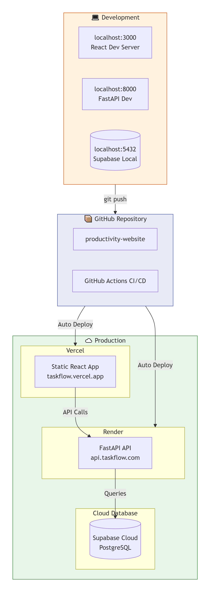

mkdir -p docs
cat > docs/architecture-diagrams.md << 'EOF'

# TaskFlow System Architecture Diagrams

## 🏗️ System Architecture

[Insert first flowchart here]

## 📊 API Flow

## 🧠 AI Pipeline

## 📋 Database Schema

## 🔄 Error Handling

## 🚀 Deployment

EOF

git add docs/architecture-diagrams.md
git commit -m "docs: Add detailed architecture diagrams for backend system"
