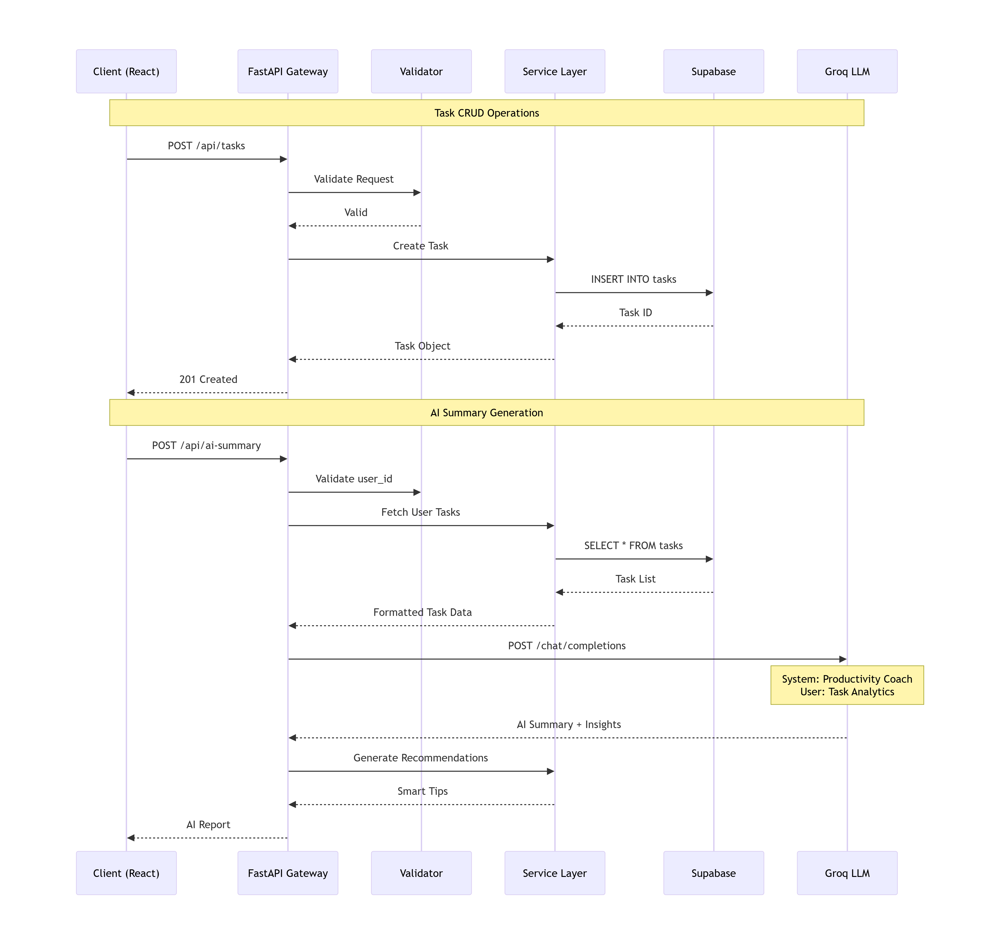
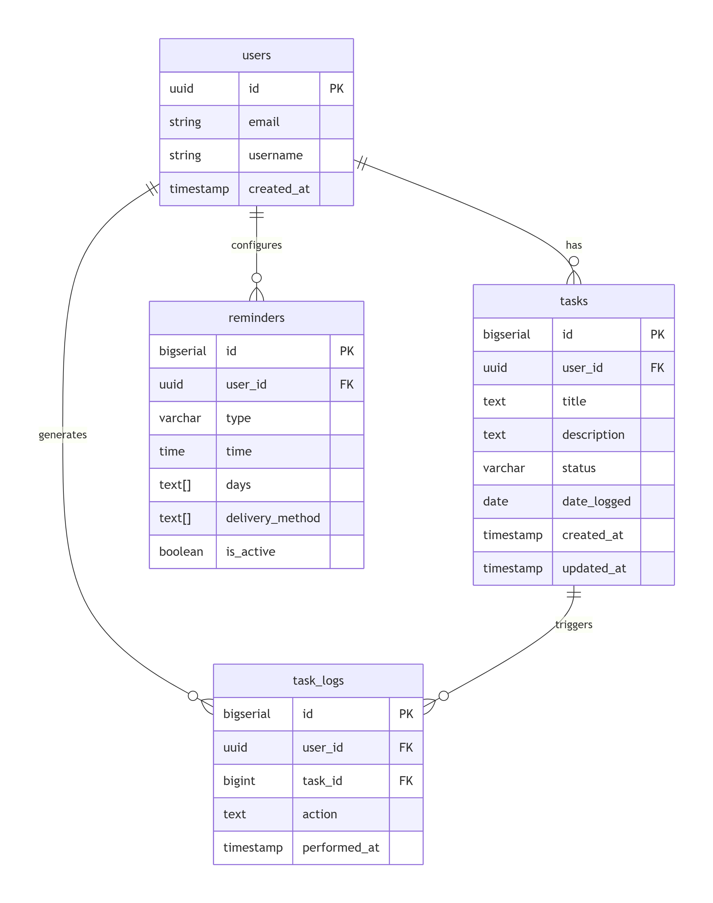
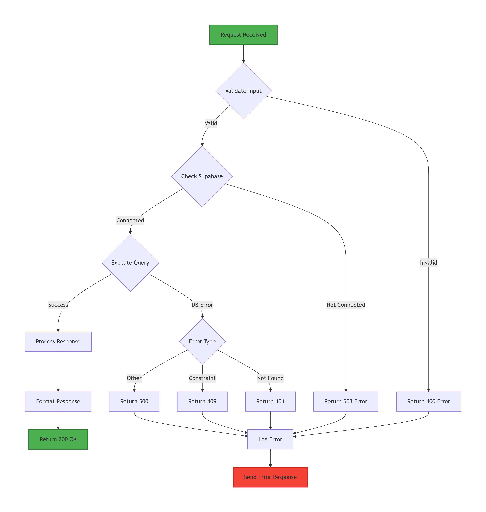

mkdir -p docs
cat > docs/architecture-diagrams.md << 'EOF'

# TaskFlow System Architecture Diagrams

## System Architecture

[Insert first flowchart here]

## API Flow

## AI Pipeline

## Database Schema

##  Error Handling

##  Deployment

EOF

git add docs/architecture-diagrams.md
git commit -m "docs: Add detailed architecture diagrams for backend system"
